# Read-Black Tree
> A Red-Black tree (Abbreviated as "R-B Tree") is a balanced binary search tree. It is to solve the complexity of ordinary binary search trees in the process of data update, caused by degradation problems. The height of the red-black tree is approximately log n, so it is approximately balanced. The time complexity of the insertion, deletion, and search operations is O(logn).

## Defination
- The root node is black
- Each leaf node is a black empty node (NIL) which is the leaf node does not store data
- No adjacent nodes can be red at the same time which is red nodes are separated by black nodes
- Every node, and all paths from it to its reachable leaf nodes, contain the same number of black nodes
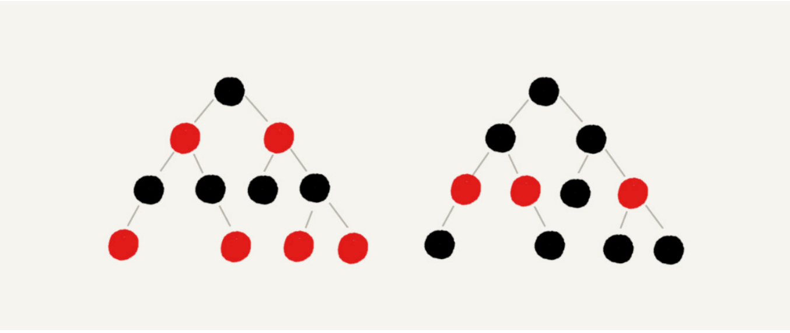

## Insertion
> Inserted nodes must be red. Moreover, newly inserted nodes in the binary search tree are placed on leaf nodes.

### Situations
- If the parent node of the inserted node is black, then we don't need to do anything, it still meets the definition of a red-black tree.
- If the inserted node is the root node, then we can directly change its color and turn it into black.
- In other cases, it would violate the definition of a red-black tree, so we need to make adjustments. The adjustment process involves two basic operations: left and right rotations, and changing colors.

### Cases
#### CASE1: if the node of interest is a, its uncle node d is red
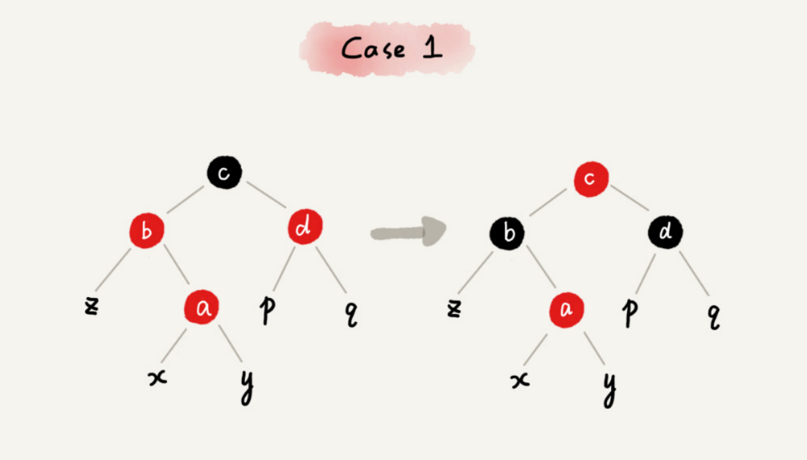
1. Set the colors of the parent node b and uncle node d of the focused node a to black
2. Set the color of the grandparent node c of the focused node a to red
3. The node of interest becomes the grandparent node c of a
4. Skip to case2 or case3

#### CASE2: if the node of interest is a, its uncle node d is black, and the node of interest a is the right child node of its parent node bs
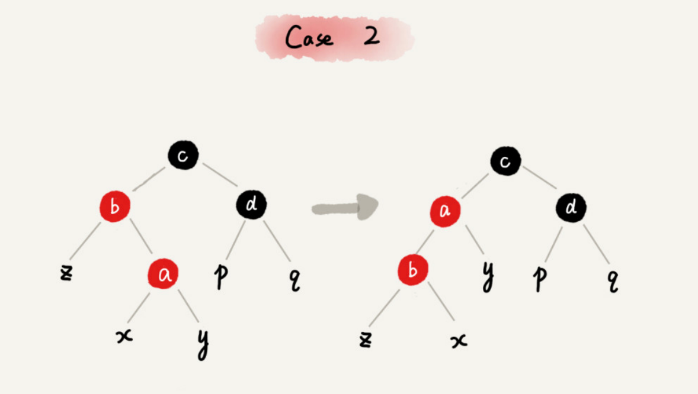
1. The node of interest becomes the parent node b of node a
2. Turn left around the new focus node b
3. Skip to CASE 3

#### CASE3: if the node of interest is a, its uncle node d is black, and the node of interest a is the left child node of its parent node b
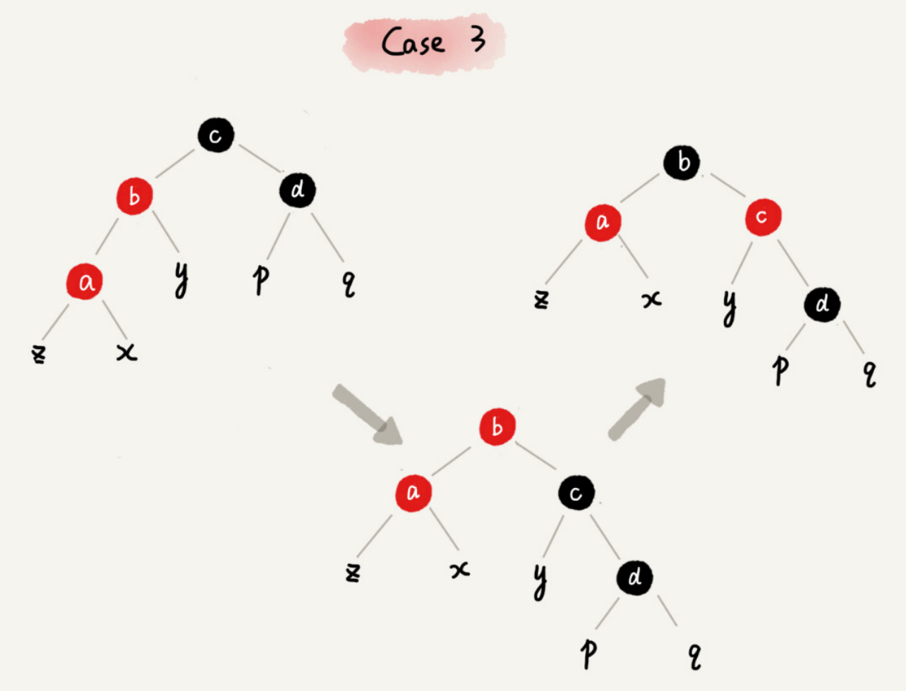
1. Rotate right around the grandparent node c of the node of interest a;
2. Swap the colors of parent node b and sibling node c of node a.
3. Adjustment is over.

## Deletion
>The balance adjustment of the deletion operation is divided into two steps. The first step is the preliminary adjustment for the deleted node. The preliminary adjustment only ensures that the entire red-black tree still meets the last defined requirement after a node is deleted which is each node and all paths from the node to its reachable leaf nodes contain the same number of black nodes. The second step is to make a secondary adjustment to the node of interest so that it meets the third definition of the red-black tree which is there are no two adjacent red nodes.

### Step1: Initial adjustments for deleting nodes
> It should be noted here that the definition of a red-black tree "only contains red nodes and black nodes". After preliminary adjustments, in order to ensure that the last requirement of the definition of a red-black tree is met, some nodes will be marked with two colors, "red" - black" or "black - black". If a node is marked "black - black", then when calculating the number of black nodes, it will be counted as two black nodes. In the following explanation, if a node can be either red or black, when drawing, I will use half red and half black to represent it. If a node is "red-black" or "black-black", I use a small black dot in the upper left corner to represent the extra black.
#### CASE1: If the node to be deleted is a, it has only one child node b
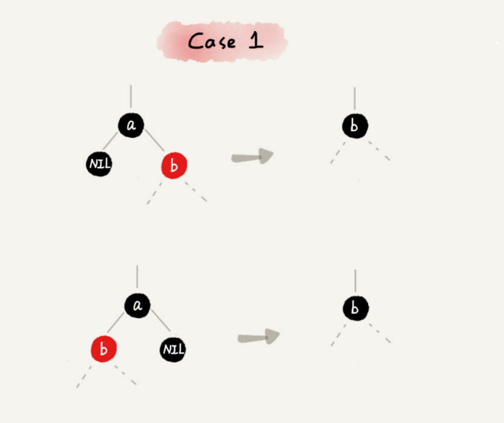
1. Delete node a and replace node b to the position of node a. This part of the operation is the same as the deletion operation of an ordinary binary search tree
2. Node a can only be black, node b can only be red, and other situations do not meet the definition of a red-black tree. In this case, we change node b to black
3. The adjustment is completed and no secondary adjustment is required

#### CASE2: If the node a to be deleted has two non-empty child nodes, and its successor node is the right child node c of node a
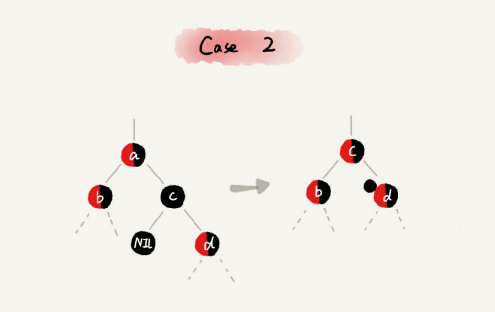
1. If the successor node of node a is the right child node c, then the right child node c must not have a left subtree. We delete node a and replace node c to the position of node a. This part of the operation is no different from the ordinary binary search tree deletion operation;
2. Then set the color of node c to the same color as node a
3. If node c is black, in order not to violate the last definition of a red-black tree, we add an extra black color to the right child node d of node c. At this time, node d becomes "red-black" or "black-black"
At this time, the node of interest becomes node d, and the second step of adjustment operation will be performed on the node of interest.

#### CASE3: If the node a is to be deleted, it has two non-empty child nodes, and the successor node of node a is not a right child node
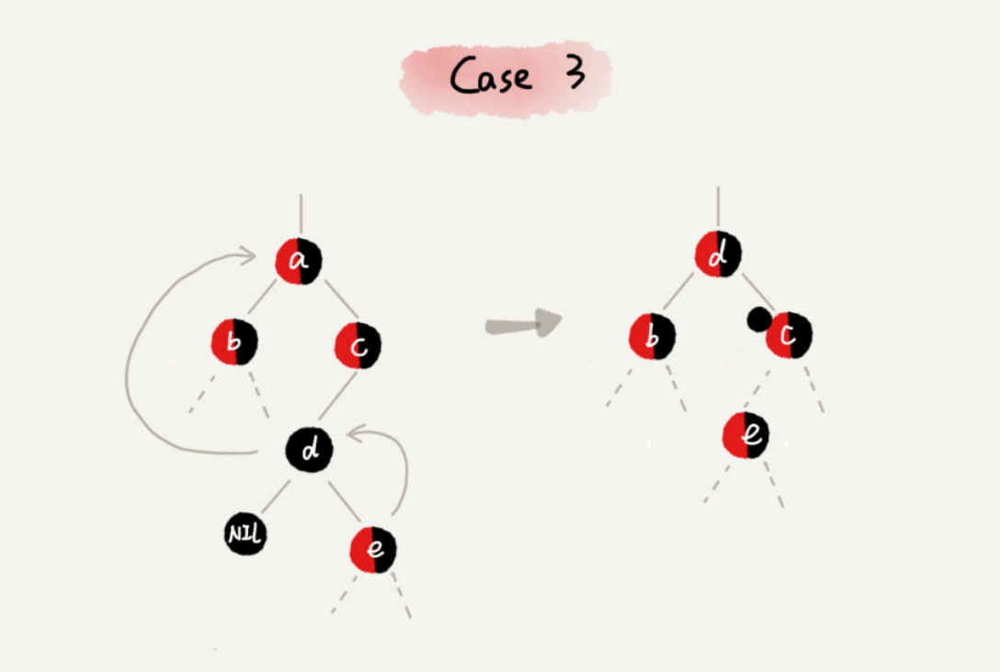
1. Find the successor node d and delete it. The process of deleting the successor node d refers to CASE 1
2. Replace node a with successor node d
3. Set the color of node d to the same color as node a
4. If node d is black, in order not to violate the last definition of a red-black tree, we add an extra black color to the right child node c of node d. At this time, node c becomes "red-black" or "black-black"
At this time, the node of interest becomes node c, and the second step of adjustment operation will be performed on the node of interest.

### Step2: Make secondary adjustments to focus on nodes
> After preliminary adjustments, the nodes of concern became “red-black” or “black-black” nodes. For this focus node, we will divide it into four situations to make secondary adjustments. The secondary adjustment is to ensure that there are no adjacent red nodes in the red-black tree.

#### CASE1: If the node of interest is a, its sibling node c is red
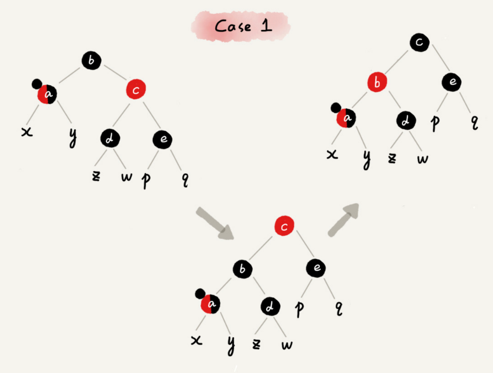
1. Rotate left around the parent node b of the focused node a;
2. Focus on the parent node b and grandparent node c of node a and exchange colors;
3. The focus node remains unchanged;
Continue to select appropriate rules from the four situations to adjust.

#### CASE2: If the node of interest is a, its sibling node c is black, and the left and right child nodes d and e of node c are both black
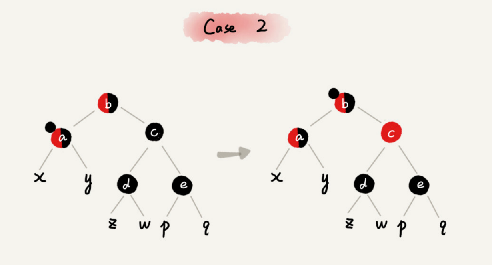
1. Change the color of the sibling node c of the focused node a to red
2. Remove a black color from the focus node a. At this time, the node a is simply red or black
3. Add a black color to the parent node b of the focused node a. At this time, the node b becomes "red-black" or "black-black"
4. The node of interest changes from a to its parent node b
Continue to select the matching rules from the four situations to adjust.

#### CASE3: If the node of interest is a, its sibling node c is black, the left child node d of c is red, and the right child node e of c is black
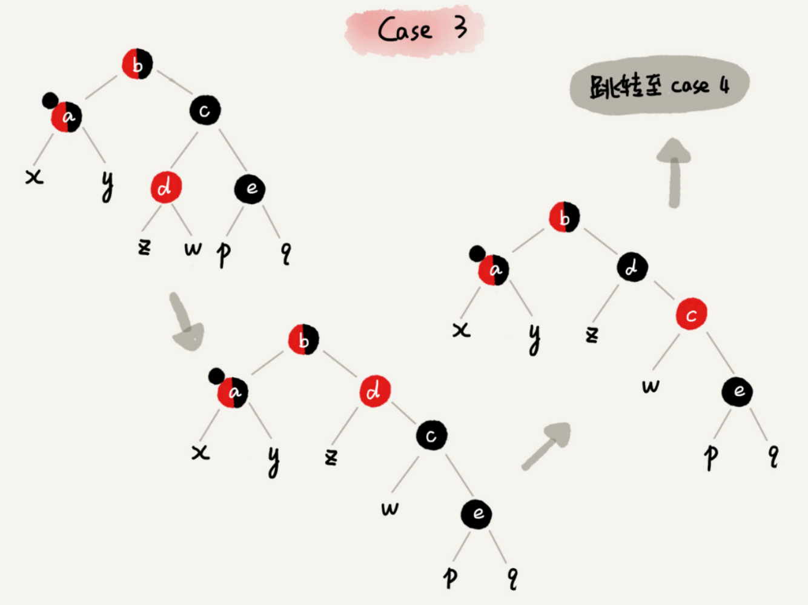
1. Rotate right around the sibling node c of the node of interest a
2. Node c and node d exchange colors
3. The focus node remains unchanged
Jump to CASE 4 and continue adjusting.

#### CASE4: If the sibling node c of the focused node a is black, and the right child node of c is red
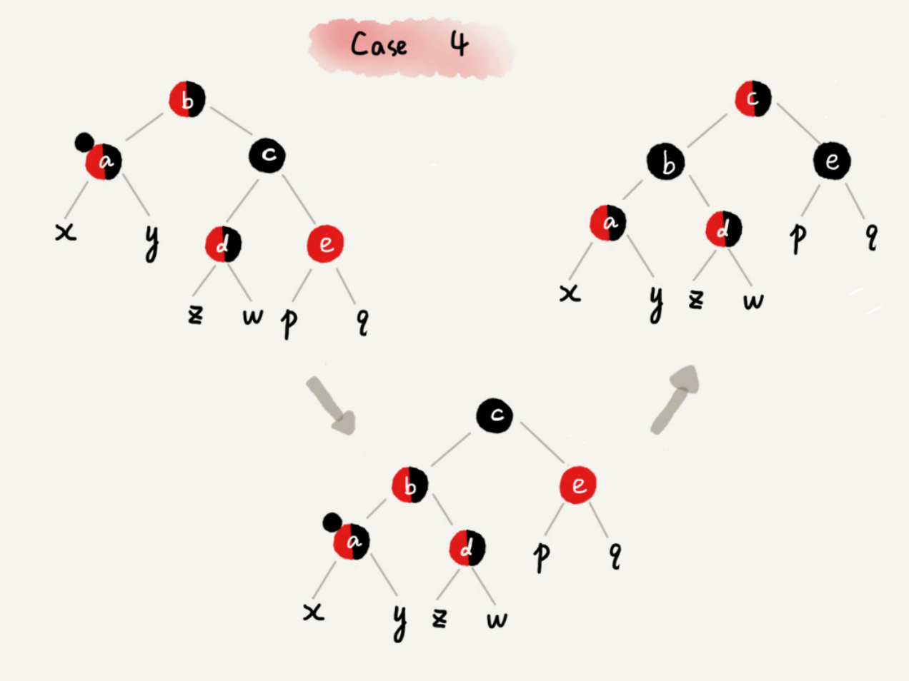
1. Rotate left around the parent node b of the focused node a;
2. Set the color of the sibling node c of the focused node a to the same color as the parent node b of the focused node a;
3. Set the color of the parent node b of the focused node a to black;
4. Remove a black color from the focus node a, and the node a becomes simply red or black;
5. Set the uncle node e of the focused node a to black;
Adjustment is over.

## Conclusion
- The first point is to compare the process of balancing the red-black tree to solving a Rubik's Cube. Don't delve too deeply into the correctness of this algorithm. You just need to understand that as long as you follow the fixed operating steps, maintain the insertion and deletion process, and do not destroy the definition of the balanced tree.

- The second point is to find the focus node accurately and don’t lose or make the wrong focus node. Because each operation rule is based on the focus node, only by getting the focus node right can it be mapped to the correct operation rule. During the iterative adjustment process, the focus nodes are constantly changing, so you must be careful not to lose the focus nodes during this process.

- The third point is that the balance adjustment of the insertion operation is relatively simple, but the deletion operation is more complicated. For the deletion operation, we have made two adjustments. The first time is to make preliminary adjustments to the node to be deleted, so that the adjusted red-black tree continues to meet the fourth definition, "The path from each node to the reachable leaf node includes The same number of black nodes". But at this time, the third definition is not satisfied, and there may be two red nodes adjacent to each other. The second adjustment is to solve this problem so that there are no adjacent red nodes in the red-black tree.