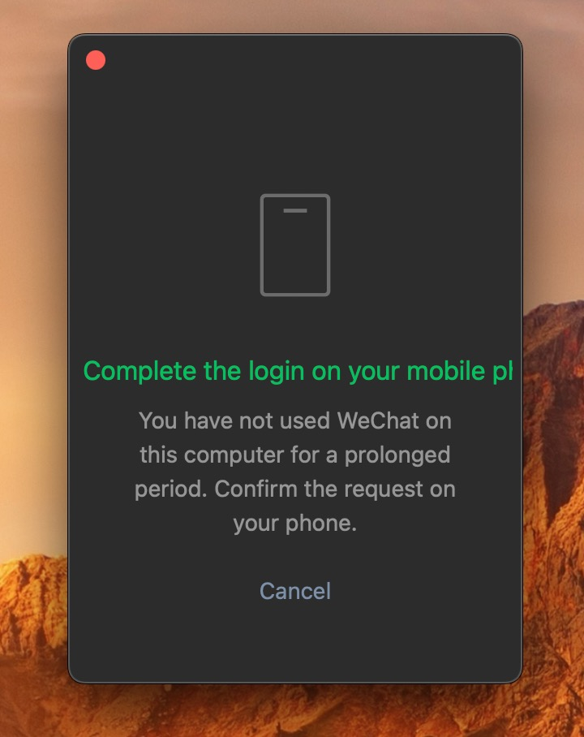

## 2023-11-01
### Add the User to the Sudo Group
```shell
usermod -aG sudo username
```


---


## 2023-10-31
### 速度、延迟还不错的梯子
- [风之谷](https://fengzg.net/#/register)
- [balala.io](https://balala.io/auth/register)

### React native 3D preview
[react-native_3d_store](https://github.com/alexandrius/react-native_3d_store)

### The Wobbling CSS Loaders Collection
[css loaders](https://css-loaders.com/wobbling/)

---


## 2023-10-30
### 微信显示bug
当系统选择英语的时候，登陆界面文字排版会异常


### Exploring Unicode
[2023 年每个软件开发者都必须知道的关于 Unicode 的最基本的知识（仍然不准找借口！）](https://blog.xinshijiededa.men/unicode/)
[你懂乱码吗？锟斤拷烫烫烫（详解ASCII、Unicode、UTF-32、UTF-8编码）| Mojibake?](https://youtu.be/kOp0W08Ad0s)

---


## 2023-10-29
### Alternatives to Screen Studio
[gemoo](https://gemoo.com/focusee)

---


## 2023-10-26
### Bilingual subtitles in mobile
[Dual Subtitles for YouTube](https://github.com/DualSubs/YouTube)

### Vps benchmark
[融合怪测评脚本](https://github.com/spiritLHLS/ecs)

### Debian enable bbrz
```shell
#add bbr config in sysctl.conf 
echo "net.core.default_qdisc=fq" >> /etc/sysctl.conf
echo "net.ipv4.tcp_congestion_control=bbr" >> /etc/sysctl.conf

#reload /etc/sysctl.conf
sysctl -p

#check wheather the bbr feature is enabled in linux kernel
sysctl net.ipv4.tcp_available_congestion_control

#check wheather the bbr is enable
lsmod | grep bbr
```

### Xray
[Xray-install](https://github.com/XTLS/Xray-install)


---